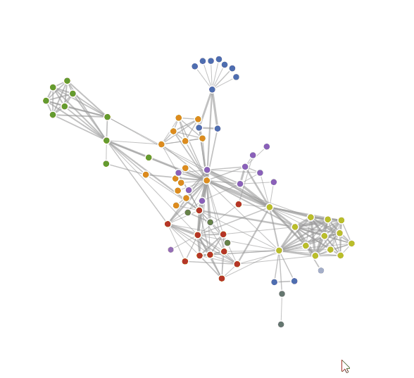

# Conflux style DAG 前端可视化工具参考建议

## Overview

首先需要声明，我个人对国内“前端”的定义并不了解太多。在我的认知里，内嵌于页面端的交互式可视化工程应该划归到前端的工作范畴中。但也许在国内，该工作会被划分到“数据可视化工程师” 这种工种里面。这个就需要你们这边来搞定实际的工作区别了。

Conflux这边的需求从抽象层面来看其实挺清晰的。也就是在用户的某个查询页面里，有一个Conflux公链的可视化元素。该元素与传统的页面区别就在于其更偏向实时绘画渲染，而非响应式UI组件或者静态元素。从一个简单粗暴的概念层面来看，要实现这样子的渲染，无非三条路径：

1. 实时生成动态材质(Texture)，加载到动态Canvas上然后每帧刷新
2. 通过某种脚本批量操控SVG元素，并使用CSS Animation来进行动态规划
3. 通过WebGL来做Scene/Camera based的场景逻辑。本质和使用OPENGL等通用图像引擎类似。

从头来做这些当然特别麻烦。好在前人留下了足够多的工具来做这些事情。我这边简单提供一些我知道的工具，同时也会提供一些不使用Javascript但是同样可以制作网页端数据可视化的方法。

## [P5.js](https://p5js.org/)

### 简单概述：
P5.js的前身是Processing，是一个给艺术家用的可视化工具。实现方法其实是制作动态Canvas。支持WEBGL，逻辑上非常像功能性画板，设计上非常像一些传统二维游戏引擎的实现。但同时支持基础3d渲染，同时允许DOM编程

### 优点：
1. 开发非常迅速。以如下代码为案例

```javascript
var pg;

function setup(){
  createCanvas(710, 400);
  pg = createGraphics(400, 250);
}

function draw(){
  fill(0, 12);
  rect(0, 0, width, height);
  fill(255);
  noStroke();
  ellipse(mouseX, mouseY, 60, 60);

  pg.background(51);
  pg.noFill();
  pg.stroke(255);
  pg.ellipse(mouseX, mouseY, 80, 80);

  //Draw the offscreen buffer to the screen with image()
  image(pg, 0, 0);
}
```

实现效果如下：


2. 语法特别像Processing，或者说传统的OOP Language。如果之前写过Processing的话上手不需要额外成本
3. 由于仅编辑动态Canvas，不会搞坏别的网页元素。
4. 支持基于Box2D的物理


### 缺点：
1. 如果不用WEBGL会慢的飞起。落脚到实现全部都是CPU硬算二维材质。
2. 但是如果用WEBGL做2D渲染，会有大量的问题（颜色失真，锯齿化严重，etc）
3. 由于Processing Foundation的大部分功能库其实是研究生学生维护的，核心库没什么问题，但是功能库可能好坏参半。


### 可能的替代
[Anime.js](https://animejs.com/)

P5.js 还是太学生气了一些。简单的搜索之后发现Anime.js可能会更加专业，也更JS。
但这玩意怎么写我看不懂，可能看你们的需求


## [D3.js](https://d3js.org/)

最为主流的数据可视化工具。逻辑是Overview里面的2，本身的实现逻辑基本上是：1. 读取数据；2. 基于数据生成SVG对象； 3. 事件编程。因此这玩意同时有极大的兼容性。

简单案例：
[Force-Directed Graph](https://beta.observablehq.com/@mbostock/d3-force-directed-graph)
比较像你们可能需要的东西


### 优点
1. 在数据可视化方面使用非常主流
2. 大量已有案例，社区活跃度很高

### 缺点
1. 不用模板的话，搞起来非常痛苦，会有一定的入门门槛

### 替代
主要是大部分的JS工程师只是想画一个图表，因此有这么一个页面专门讲这事：
[20个替代](https://alternativeto.net/software/d3-js/)
然后我在[Vis.js](http://visjs.org)找到了蛮多你们可能用得到的案例。例如这个：
[smoothWorldCup](http://visjs.org/examples/network/edgeStyles/smoothWorldCup.html)


## [Three.js](https://threejs.org/) & [Babylon.js](https://www.babylonjs.com/)

如果你们的工程师会写Scene/Objects/Camera based 的set up的话，用WebGL的封装库会是个不错的选择。Three.js 和 Babylon.js算是比较主流的。前者比较老，有大量的版本兼容问题，但支持文档给力。后者新，版本兼容非常好，但是支持文档和案例比较少。

但无论如何，这俩库主要是给页端写3D的。当然3D引擎肯定可以写2D内容（Camera设置成单一平面非透视即可），本身也允许和写GL的逻辑一样写shader，运行效率比上述所有都高。自然学习成本也很高昂。

以及使用d3.js + three.js是一个蛮常用的套路

案例：
[3d force-directed graph](https://github.com/vasturiano/3d-force-graph)
已经开源，还手把手教，简直业界良心


## 非JS的页端工具

Python如果写得好的话可以尝试使用[bokeh](https://bokeh.pydata.org)

游戏引擎会用的话，上Unity/Unreal都是不错的选择（我提供的那个demo是用Unity写的）

## 案例搜索建议

由于Conflux是一个DAG，DAG本身其实不是啥太新的结构，直接谷歌搜索Directed Graph Visualization有蛮多实际案例的